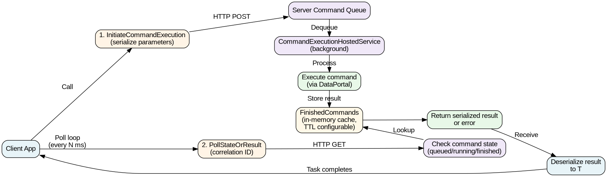

# Csla.PollingCommand

[](https://www.nuget.org/packages/Ossendorf.Csla.PollingCommand)
[](https://www.nuget.org/packages/Ossendorf.Csla.PollingCommand)
[](https://github.com/StefanOssendorf/Csla.PollingCommand/issues)

A CSLA polling command execution service for long-running operations. Allows commands to execute asynchronously on the server while the client polls for completion—useful in environments with request timeouts (like Azure App Service).

## TL;DR

**Problem:** Some deployment environments enforce hard request timeouts. Long-running CSLA commands can't complete within this window.

**Solution:** Split execution into two phases:
1. Client initiates command → server queues it → returns immediately with a correlation ID
2. Server's background service executes the command asynchronously
3. Client polls the server repeatedly until the result is ready

**Minimal setup:**

Server:
```csharp
services.AddPollingCommandServer();
```

Client:
```csharp
services.AddPollingCommandClient(TimeSpan.FromMilliseconds(250));
var result = await sp.GetRequiredService<IPollingCommand>().Execute<MyCommand>();
```

**When to use:** Any long-running CSLA command. Transparent to your command logic—no changes needed to your `CommandBase<T>` classes.

## How it works



1. **Client calls** `IPollingCommand.Execute<T>()` → serializes parameters → sends `InitiateCommandExecution` to server
2. **Server** queues the command, returns a correlation `Guid` immediately
3. **Background service** (`CommandExecutionHostedService`) dequeues commands and executes them via CSLA's DataPortal
4. **Results** are cached in memory with a configurable TTL
5. **Client polls** `PollStateOrResult` repeatedly until the command finishes
6. **On completion**, the client receives the result, deserializes it, and completes the `Task<T>`
7. **On error**, the exception is propagated back to the client

## Getting Started

### Prerequisites

- .NET 8, 9, or 10
- CSLA library (10.1.0 or later)
- CSLA DataPortal configured for client-server communication (any transport layer supported by CSLA)

### Server Setup

Any CSLA server with hosted service support (ASP.NET Core, generic `IHost`, etc.) can host the polling command server:

```csharp
// Any .NET app with dependency injection and IHostedService support
var services = new ServiceCollection();

// Configure CSLA with server-side DataPortal
services.AddCsla(options => 
    options.DataPortal(dp => dp.AddServerSideDataPortal())
);

// Register the polling command server
services.AddPollingCommandServer(options =>
{
    // Optional: customize TTL for finished command results (default: 5 minutes)
    options.FinishedCommandTtl = TimeSpan.FromMinutes(10);
});

// Start the host (ASP.NET Core, generic IHost, etc.)
// The background service will start automatically
```

The server automatically sets up:
- An in-memory command queue
- A background service (`CommandExecutionHostedService`) to dequeue and execute commands
- An in-memory cache for finished command results with configurable TTL
- Automatic cleanup of expired results

### Client Setup

```csharp
var services = new ServiceCollection();

// Configure CSLA with a client-side DataPortal
// (transport depends on your server setup — HTTP, gRPC, etc.)
services.AddCsla(options =>
    options
        .AddConsoleApp()  // or .AddAspNetCore(), etc.
        .DataPortal(dp => dp.AddClientSideDataPortal(
            clientDataPortal => clientDataPortal.UseHttpProxy(
                httpProxy => httpProxy
                    .WithDataPortalUrl("https://your-server/api/dataportal")
                    .WithTimeout(TimeSpan.FromMinutes(1))
            )
        ))
);

// Register the polling command client
// Argument: default polling interval for all Execute calls
services.AddPollingCommandClient(pollingInterval: TimeSpan.FromMilliseconds(250));

var sp = services.BuildServiceProvider();
```

### Define Your Command

Use any CSLA `CommandBase<T>` as usual—no special setup required. Declare result properties using `[CslaImplementProperties]`:

```csharp
[CslaImplementProperties]
public partial class LongRunningCommand : CommandBase<LongRunningCommand>
{
    public partial string ResultMessage { get; set; }
    public partial Guid ResultId { get; set; }

    [Execute]
    private async Task Execute()
    {
        // Long-running work
        await Task.Delay(TimeSpan.FromSeconds(30));

        // Set result properties
        ResultMessage = "Operation completed";
        ResultId = Guid.NewGuid();
    }
}
```

Input parameters go as method arguments to `[Execute]`:

```csharp
[CslaImplementProperties]
public partial class CommandWithInput : CommandBase<CommandWithInput>
{
    public partial string Output { get; set; }

    [Execute]
    private void Execute(string input)
    {
        Output = $"Processed: {input}";
    }
}
```

### Execute from the Client

```csharp
var pollingCommand = sp.GetRequiredService<IPollingCommand>();

// Execute without parameters
var result = await pollingCommand.Execute<LongRunningCommand>();
Console.WriteLine(result.ResultMessage);

// Execute with parameters
var result2 = await pollingCommand.Execute<CommandWithInput>("param-value");
Console.WriteLine(result2.Output);

// Override polling interval for a single call
var result3 = await pollingCommand.Execute<LongRunningCommand>(
    new PollingOptions { Interval = TimeSpan.FromMilliseconds(500) }
);

// Execute with both options and parameters
var result4 = await pollingCommand.Execute<CommandWithInput>(
    new PollingOptions { Interval = TimeSpan.FromMilliseconds(500) },
    "param-value"
);
```

The `Execute<T>` method:
- Returns a `Task<T>` that completes when the server finishes executing the command
- Throws an exception if the command fails on the server
- Is fully awaitable and integrates naturally with async/await code

## Configuration

### Server Options

Set via `AddPollingCommandServer`:

```csharp
services.AddPollingCommandServer(options =>
{
    // How long to keep finished command results in memory
    // After this TTL expires, attempting to poll a finished command returns null
    // Default: 5 minutes
    options.FinishedCommandTtl = TimeSpan.FromMinutes(10);
});
```

### Client Options

**Default polling interval** — set when registering:
```csharp
services.AddPollingCommandClient(TimeSpan.FromMilliseconds(250));
```

**Per-call override** — use `PollingOptions`:
```csharp
await pollingCommand.Execute<MyCommand>(
    new PollingOptions { Interval = TimeSpan.FromMilliseconds(500) }
);
```

## ⚠️ Limitations & Warnings

> [!WARNING]
> **Currently executing commands are lost on server restart.** All command state is held in memory only. If the server crashes or restarts, any in-flight commands (queued or executing) will be abandoned. Clients will timeout waiting for results that will never arrive. This library is not suitable for scenarios requiring guaranteed execution durability.

## Requirements

- **.NET:** 8.0, 9.0, or 10.0
- **CSLA:** 10.1.0 or later
- **Server:** CSLA server with `IHostedService` support (ASP.NET Core, generic `IHost`, etc.)
- **Client:** CSLA client with a configured DataPortal (any supported transport)
- **Serialization:** Server and client must share compatible serialization format (CSLA's default or custom)

## License

MIT

## Contributing

Issues and pull requests welcome! Please report bugs at [GitHub Issues](https://github.com/StefanOssendorf/Csla.PollingCommand/issues).
